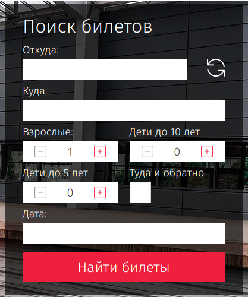

[GitHub Pages](https://lekseff.github.io/AHJ_5-2/)

### Trip Calendar* (задача со звёздочкой)

Важно: эта задача не является обязательной. Её (не)выполнение не влияет на получение зачёта по ДЗ.

#### Легенда

Вы делаете сервис для путешествий и вам необходимо реализовать виджет выбора дат: туда и (если установлена галочка туда-обратно) обратно.

Аналог вы можете посмотреть на сайте РЖД и любых авиакомпаний:

#### Описание

Вам нужно реализовать только переключатель туда-обратно и виджеты ввода дат/выбора их из календаря, в соответствии со следующими условиями:

1. Дата "туда" должна быть не раньше, чем сегодняшняя дата (по времени браузера)
1. Сегодняшняя дата должна быть выделена
1. Даты до сегодняшней должны быть не активны
1. Должно быть реализовано переключение месяца (без анимации, просто пересчёт дат)
1. Дата "обратно" не может быть ранее даты "туда"

Для расчёта дат воспользуйтесь библиотекой `moment js` (обязательное условие). Установите и подключите её через npm/yarn.

Не забудьте написать авто-тесты, разделив логику и взаимодействие с DOM. Для тестирования взаимодействия с DOM пользуйтесь JSDOM или Puppeteer.
